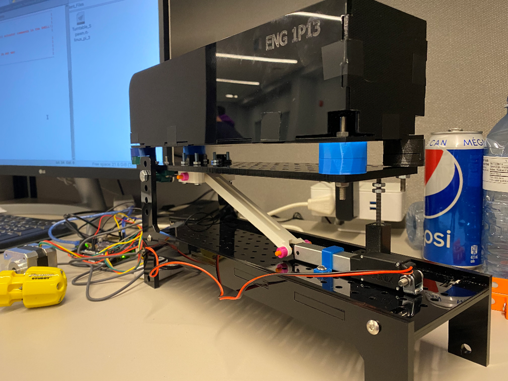

# Recycling Sorting System

McMaster ENGINEER 1P13, Jan 2022 – Mar 2022.

Sensor equipped robot that identifies waste by material type and autonomously sorts it into designated bins along a fixed track, using a custom designed rod and pin mechanism to tip the hopper and release its contents.

`Python` `Autodesk Inventor` `3D Printing` `Quanser Interactive Labs` `Robotics`

 
<em>Full CAD-Modelled Mechanism Attached to the Hopper and Linear Actuator.</em>

---

## Table of Contents
- [Overview](#overview)
- [Hardware & Software](#hardware--software)
- [System Workflow](#system-workflow)
- [How It Works](#how-it-works)
  - [1. Material Detection](#1-material-detection)
  - [2. Loading](#2-loading)
  - [3. Navigation & Positioning](#3-navigation--positioning)
  - [4. Actuation Mechanism](#4-actuation-mechanism)
- [CAD & Physical Mechanism](#cad--physical-mechanism)
- [Results](#results)
- [Full Report](#full-report)

---

## Overview

This project addresses Canada's low recycling rate, where sensor limitations in identifying material type and contamination make large scale sorting difficult, resulting in most plastic waste ending up in landfills. The finished system is a small scale robot that identifies waste dispensed onto a rotary table, loads it onto a hopper, navigates a fixed track, and deposits it into the correct designated bin. The system combines a Quanser Q-bot equipped with ultraviolet, IR, colour, and LDR sensors, a Quanser Q-arm robotic arm, and a Python program built in Quanser Interactive Labs to identify, load, and navigate, with a custom designed rod and pin mechanism, modelled in Autodesk Inventor and 3D printed, that connects the linear actuator to the hopper to release its contents at each bin.

---

## Hardware & Software

### Hardware

| Component | Purpose |
|---|---|
| Quanser Q-bot | Mobile robot base that carries the hopper, follows the fixed track, and positions itself in front of each bin |
| Quanser Q-arm | Robotic arm that loads dispensed containers from the rotary table onto the hopper |
| Ultraviolet Sensor | Assists in identifying material type of each dispensed container |
| IR (Infrared) Sensor | Keeps the robot following its fixed line track |
| Colour Sensor | Detects the colour of each container to help classify material type |
| LDR (Light Dependent Resistor) Sensor | Detects light levels to assist material identification |
| Ultrasonic Sensor | Measures distance to position the robot accurately in front of each bin before disposal |
| Linear Actuator | Mounted to the system's baseplate, drives the rod and pin mechanism to tip the hopper and release waste into the correct bin |
| Rod, Slider, and Pins | Custom designed mechanism connecting the linear actuator to the hopper, converting linear actuation into hopper rotation |
| Rotary Table | Dispenses waste containers at random for the robot to identify and load |

### Software

| Tool / Library | Purpose |
|---|---|
| Autodesk Inventor | CAD modelling of the rod and pin mechanism and its individual components |
| Quanser Interactive Labs (Q-Labs) | Virtual environment simulating the Q-bot, Q-arm, sensors, and recycling facility layout |
| Python | Program controlling detection, loading, navigation, dumping, and return to home position |

---

## System Workflow

| Stage | Component | Output |
|---|---|---|
| Dispensing | Rotary Table | Container placed at random with an assigned material id and weight |
| Detection | Quanser Q-bot Sensors | Material type identified for each container |
| Loading | Quanser Q-arm | Up to 3 containers loaded onto the hopper, combined weight capped at 90 grams |
| Navigation | IR Sensor, Fixed Line Track | Robot follows the track toward the identified bin |
| Positioning | Ultrasonic Sensor | Robot stopped at the correct distance from the bin |
| Dumping | Linear Actuator, Rod and Pin Mechanism | Hopper rotates and releases containers into the bin |
| Return | Python Program | Robot navigates back to its home position to begin the next cycle |

---

## How It Works

### 1. Material Detection

- Containers are dispensed at random onto the rotary table, each assigned a material id used by the program to determine the correct bin.
- The ultraviolet, colour, and LDR (light dependent resistor) sensors work together to identify the material type of each container before it is loaded.
- The program compares each new container's material id against the previous one to decide whether it can be grouped with containers already loaded on the hopper.

### 2. Loading

- The Quanser Q-arm loads up to three containers from the rotary table onto the hopper per cycle.
- Containers are only added to the same load if their combined weight stays at or below 90 grams.
- If a container's destination bin differs from what is already loaded, or the weight limit would be exceeded, the current load is dumped before the new container is picked up.

### 3. Navigation & Positioning

- An onboard IR (infrared) sensor keeps the Q-bot following its fixed line track by adjusting left and right wheel speeds whenever the sensors lose the line.
- Bin locations are defined using coordinate values within the Quanser Interactive Labs environment, which the program references to navigate the robot toward the correct bin.
- Once close to the target, an ultrasonic sensor measures distance and stops the robot at the correct position in front of the bin before dumping.

### 4. Actuation Mechanism

- The linear actuator is mounted to the system's baseplate, positioned below and connected to the hopper by a rod, slider, and pin assembly designed specifically for this project.
- As the actuator extends, the rod pushes against the hopper, rotating it on its hinge and releasing its contents into the bin below.
- Pins secure both ends of the rod, with small cylindrical pieces holding each pin in place within the slider to keep the mechanism stable during repeated actuation.
- Early concepts explored a rotary actuator driving a series of gears, and a roller riding along a track, before the team settled on this simpler rod and pin design, which was refined through several rounds of sketches to work out pin placement and slider geometry before being modelled in Autodesk Inventor and fabricated by 3D printing.
- After dumping, the actuator retracts, resetting the hopper to its closed position before the robot returns home.

  <video src="https://github.com/user-attachments/assets/857b45c8-ef57-49da-bb1a-ce1d004fa818" controls></video>
  
<em>Demonstration of the CAD-Designed Rod and Pin Mechanism Extending and Tipping the Hopper to Release Its Contents.</em>

---

## CAD & Physical Mechanism

  
  

<em>CAD Model of the Rod and Pin Mechanism From the Home View (Left) and Side View Showing the Actuated Rotation (Right).</em>

NOW ADD AUTODESK PICS HERE

  
  

<em>CAD Model of the Rod and Pin Mechanism From the Home View (Left) and Side View Showing the Actuated Rotation (Right).</em>

ADD CAD MODEL PICS OF CERTAIN PARTS HERE

  
  

<em>CAD Model of the Rod (Left) and Slider (Right) Components of the Mechanism.</em>

  
  

<em>CAD Model of the Pin Securing Piece (Left) and Cylindrical Pin (Right) That Hold the Rod in Place.</em>

  
  

<em>3D Printed Rod and Pin Mechanism Mounted to the Quanser Q-bot (Left), and a Close Up View of the Rod and Pin Assembly (Right).</em>

  
  

<em>Engineering Drawings of Rod (left) and Slider (right), in mm.</em>

  
  

<em>Engineering Drawings of Cylindrical Pin Actuator Piece (left) and Cylindrical Pin (right), in mm.</em>

  

<em>Engineering Drawings of Pin Securing Piece, in mm.</em>

---

## Results

- The system functioned as a fully automated small scale sorting robot, correctly identifying waste by material type before directing it to the appropriate bin.
- The rod and pin mechanism reliably rotated the hopper and released its load once the robot reached its target, confirmed through repeated actuation testing.
- The Quanser Q-arm and hopper successfully loaded, transported, and released waste into its designated bin within the enforced 90 gram weight limit.
- The project illustrated a viable small scale model for automated sorting, supporting the broader goal of increasing recycling efficiency at facilities limited by manual sorting capacity.

---

## Full Report

[Read the Full Project Report](Files/Recycling_Sorting_System_Report.pdf)
